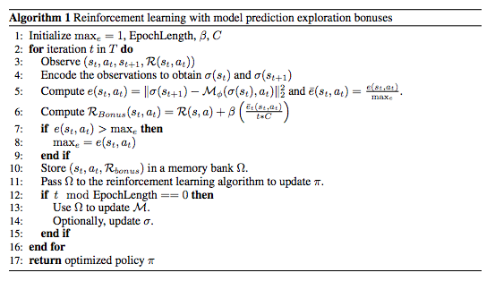

# Incentivizing Exploration In Reinforcement Learning With Deep Predictive Models

**Bradly C. Stadie, Sergey Levine, Pieter Abbeel**

Achieving efficient and scalable exploration in complex domains poses a major challenge in reinforcement learning. 

While Bayesian and PAC-MDP approaches to the exploration problem offer strong formal guarantees, they are often **impractical** in higher dimensions due to their reliance on enumerating the state-action space. 

Hence, exploration in complex domains is often performed with simple epsilon-greedy methods. 
In this paper, we consider the challenging Atari games domain, which requires processing raw pixel inputs and delayed rewards. 

We evaluate several more sophisticated exploration strategies, including **Thompson sampling and Boltzman exploration**, and propose a new *exploration* method based on assigning **exploration bonuses** from a **concurrently learned model** of the system dynamics. By parameterizing our **learned model** with a neural network, we are able to develop a scalable and efficient approach to exploration bonuses that can be applied to tasks with complex, high-dimensional state spaces. 

In the Atari domain, our method provides the most consistent improvement across a range of games that pose a major challenge for prior methods. In addition to raw game-scores, we also develop an **AUC-100 metric** for the Atari Learning domain to evaluate the impact of exploration on this benchmark.

Algorithm

## Contribution
Propose a new exploration method based on assigning exploration bonuses from a concurrently learned model of the system dynamics.
